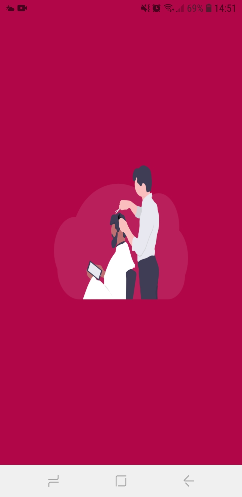
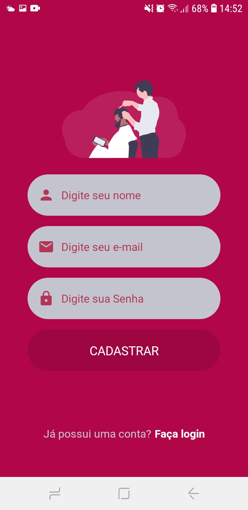
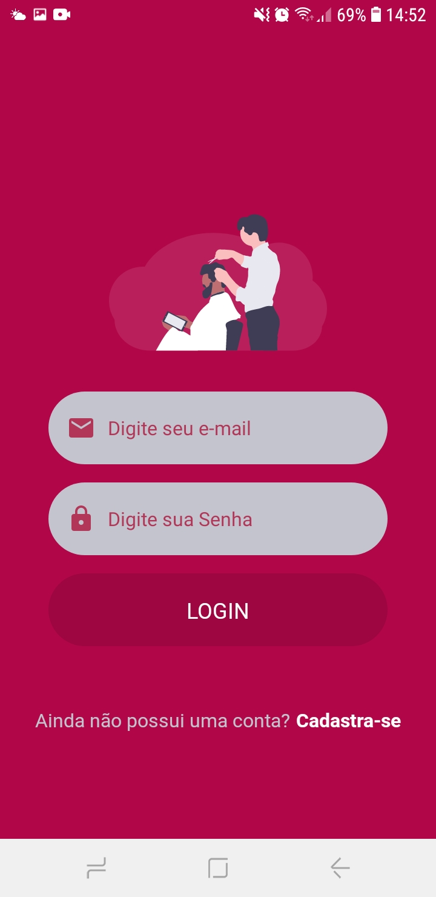
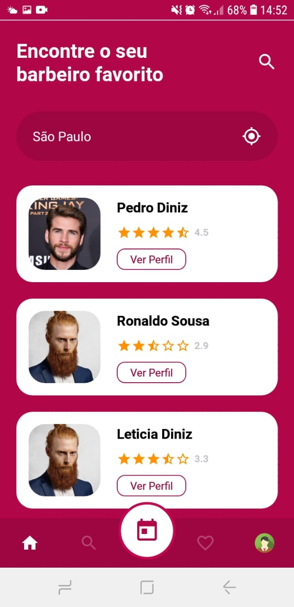
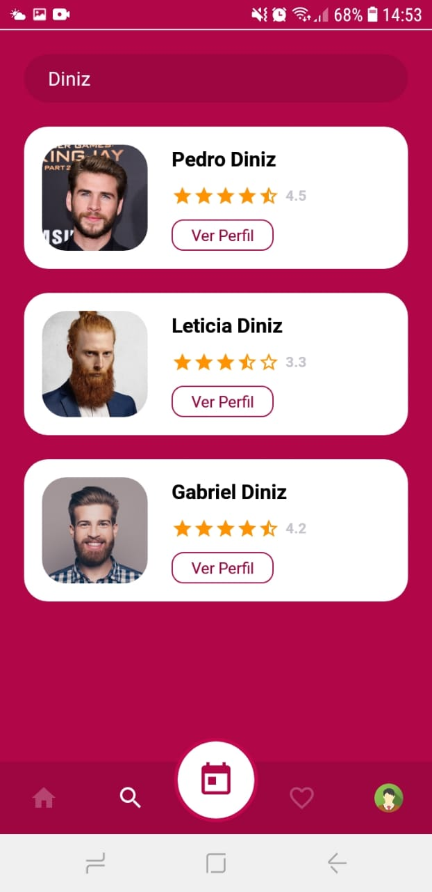
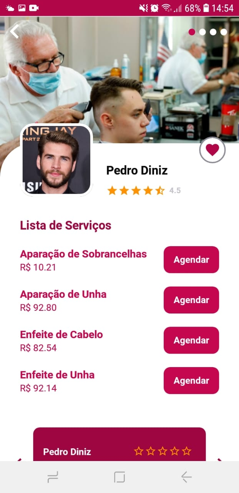
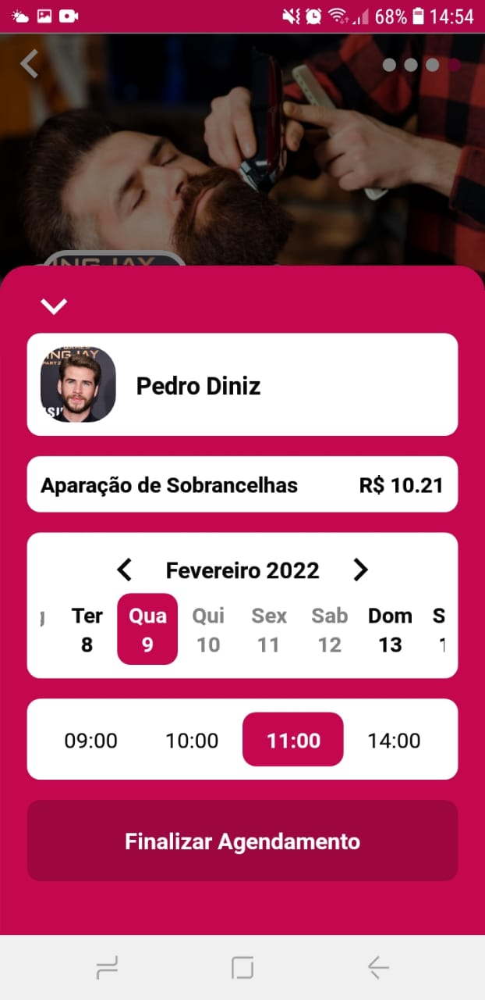
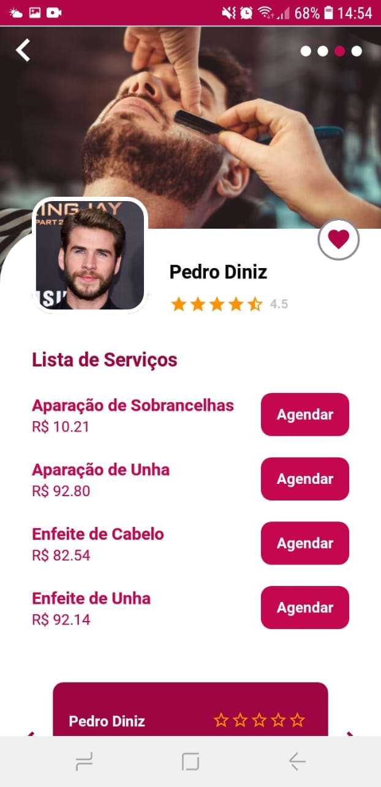
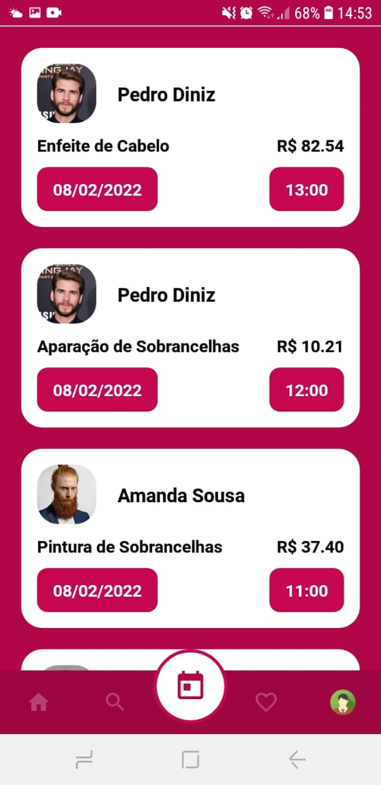
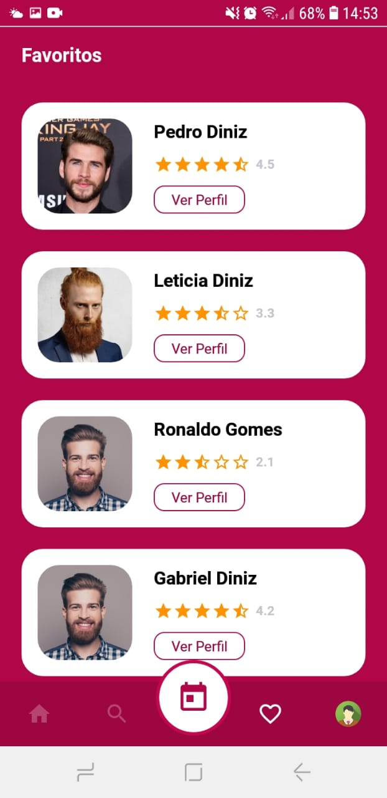

<h1 align="center">
  
  
LinsBarber o seu App de agendamento de seriços em Barbearias

</h1>

<h2 align="center">Tabela de Conteúdos</h2>

  • <a href="#sobre">Sobre</a>
  • <a href="#funcionalidades">Funcionalidades</a>
  • <a href="#layout">Layout</a>
  • <a href="#tecnologias">Tecnologias</a> 
  • <a href="#status">Status do Projeto</a> 
  • <a href="#autor">Autor</a>
  • <a href="#licenca">Licença</a>

<h2 align="center" id="sobre">Sobre</h2>

Um App de agendamentos de serviços em barbearias, nesse App o usuário vai poder fazer buscas por barbeiros, vai poder agendar os serviços, vai poder favoritar os barbeiros, consultar seus serviços adendados.

<h3 align="left" id="funcionalidades">Funcionalidades</h3>

- [x] Fazer o cardastro de usuário;
- [x] Fazer login do usuário;
- [x] Fazer agendamentos de serviços por barbeiro selecionado;
- [x] Cancelar agendamentos;
- [x] Favoritar os barbeiros;
- [x] Ler depoimentos de outros clientes;
- [x] Fazer busca de barbeiro por nome;
- [x] Acompanhar os seus agendamentos;
- [x] Consultar seus barbeiros favoritos;
- [x] Fazer logout;

<h2 align="left" id="layout">🎨 Layout</h2>

O layout da aplicação está disponível no Figma:

<h3 align="left" id="layout">Mobile</h3>

  
  

  
  

  
  

  
  

  
  

<h3 align="left" id="tecnologias">🛠 Tecnologias</h3>

As seguintes Tecnologias e bibliotecas que foram usadas na construção do projeto

- [Node.js](https://nodejs.org/en/)
- [React](https://pt-br.reactjs.org/)
- [React Native](https://reactnative.dev/)
- [Async Storage](https://react-native-async-storage.github.io/async-storage/docs/install)
- [expo-auth-session](https://docs.expo.dev/guides/authentication/)
- [expo-apple-authentication](https://docs.expo.dev/versions/latest/sdk/apple-authentication/)
- [expo-google-fonts/roboto](https://docs.expo.dev/guides/using-custom-fonts/)
- [styled-components](https://styled-components.com/docs/basics)
- [react-native-iphone-x-helper](https://github.com/ptelad/react-native-iphone-x-helper)
- [react-native-gesture-handler](https://docs.swmansion.com/react-native-gesture-handler/docs/)
- [react-navigation/native](https://reactnavigation.org/docs/getting-started/)
- [react-navigation/bottom-tabs](https://reactnavigation.org/docs/bottom-tab-navigator/)
- [react-navigation/native-stack](https://reactnavigation.org/docs/native-stack-navigator/)
- [react-native-svg](https://github.com/react-native-svg/react-native-svg)
- [react-native-svg-transformer](https://github.com/kristerkari/react-native-svg-transformer)
- [react-native-community/geolocation](https://github.com/react-native-geolocation/react-native-geolocation)
- [react-native-swiper](https://github.com/leecade/react-native-swiper)

<h2 align="left" id="status">Status do Projeto</h2>

 🚧  React Native 🚀 Versão 1.0 Concluída.  🚧.

<h2 align="left" id="autor">🦸 Autor</h2>
<a href="https://github.com/JailsonSantos">
 
  
 <b>Jailson Santos</b></a> <a href="https://www.linkedin.com/in/jailson-santos-726395104/" title="Jailson Santos">🚀</a>
  

 

<h2 align="left" id="licenca">📝 Licença</h2>

Este projeto esta sobe a licença [MIT](./LICENSE).

Feito com ❤️ por Jailson Santos 👋🏽 [Entre em contato!](https://www.linkedin.com/in/jailson-santos-726395104/)
